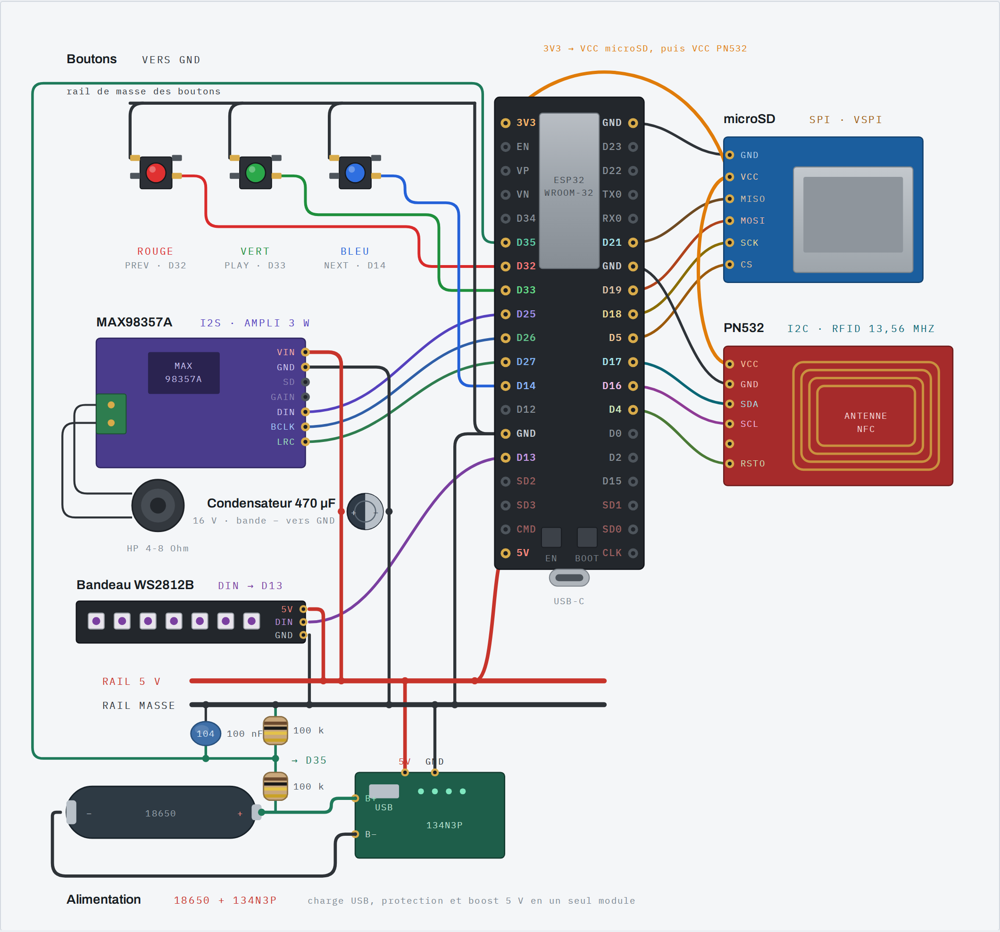

# WroomTale

Boîte à histoires et à sons RFID pour **ESP32-WROOM-32** : 4 Mo de flash, pas de
PSRAM. Inspirée d'[ESPuino](https://github.com/biologist79/ESPuino), réécrite
pour tenir dans ces contraintes.

<picture>
  <source media="(prefers-color-scheme: dark)" srcset="hardware/img/wiring-dark.png">
  
</picture>

## Fonctions

- Un tag RFID → un dossier de MP3 sur carte SD, joué en boucle.
- Histoires à embranchements : un extrait audio par nœud, la suite choisie aux
  boutons. Contenu écrit à l'avance, aucun réseau à l'exécution.
- Bandeau WS2812B : vumètre pendant la lecture, une teinte par tag, une zone de
  couleur par choix d'histoire.
- Portail web de configuration, pour associer les tags sans console série.
- Un jingle de boîte à musique au démarrage, synthétisé et embarqué en flash.
- Jauge de batterie 18650 lue sur la courbe de décharge.

## Matériel

| Périphérique | Signal | GPIO | Sans lui |
|---|---|---|---|
| MAX98357A (I2S) | BCLK / LRC / DIN | 26 / 27 / 25 | aucun son ; non détectable, le bus est unidirectionnel |
| Carte SD (SPI) | SCK / MISO / MOSI / CS | 18 / 21 / 19 / 5 | seuls le jingle et les bips se jouent ; signalé au journal |
| PN532 (I2C) | SDA / SCL / RESET | 17 / 16 / 4 | pas de tags ; signalé au journal |
| Boutons (vers GND) | PREV / PLAY / NEXT | 32 / 33 / 14 | tout passe par la console ou le portail |
| Bandeau WS2812B | DIN | 13 | aucun retour visuel |
| Mesure batterie | pont diviseur sur B+ | 35 | jauge à zéro, `batt` indique l'absence de lecture |

Montage détaillé et implantation sur Perma-Proto :
**[docs/materiel.md](docs/materiel.md)**. Source du plan :
[`hardware/wiring.html`](hardware/wiring.html).

Seul l'ESP32 est indispensable au démarrage : chaque module absent retire sa
fonction sans bloquer le boot.

## Démarrer

```bash
cd firmware
pio run -t upload         # flash via USB
pio device monitor        # console série, 115200
```

Carte SD : un dossier par album à la racine, rempli de `.mp3`. Association d'un
tag depuis la console :

```
tags                             liste les associations
bind <uid> /MonAlbum             dossier de la carte
bind <uid> builtin:boot          jingle embarqué
```

Sans console : **PLAY maintenu 2 s au démarrage** ouvre le point d'accès WiFi
`WroomTale` (mot de passe `wroomtale`), arrêt au bout de 5 min.

Commandes et réglages complets : **[docs/console.md](docs/console.md)**.

Appui court : pause/reprise, piste suivante, piste précédente.
Appui long : volume +/-, stop sur PLAY.

## Compilation

```bash
pio run -d firmware -t upload                      # la boîte
pio run -d firmware -e wroomtale-volume -t upload  # boutons axés sur le volume
pio run -d firmware -e bt -t upload                # spike A2DP
```

## Choix techniques

| Sujet | Décision | Raison |
|---|---|---|
| Lib audio | `earlephilhower/ESP8266Audio` | `ESP32-audioI2S` ne supporte plus l'ESP32 sans PSRAM ; ESP8266Audio décode en ~30 Ko de tas |
| Décodeur | Helix en IRAM | lecture sans trous sans PSRAM |
| WiFi | actif uniquement en mode config | les tâches WiFi préemptent le décodeur ; la radio coûte ~3× le courant de repos |
| OTA | absent | 4 Mo ne permettent pas deux partitions app |
| UI web | PROGMEM | évite une partition SPIFFS, laisse 3,75 Mo à l'application |
| Cœurs | audio sur 1, RFID/boutons sur 0 | le polling PN532 (timeout 50 ms) affamerait le décodeur |
| LED | périphérique RMT | WS2812B à 800 kHz, aucune interruption tolérée |

## Documentation

| | |
|---|---|
| [docs/materiel.md](docs/materiel.md) | câblage, Perma-Proto, batterie, bandeau de LED |
| [docs/console.md](docs/console.md) | commandes série, portail web, réglages NVS |
| [docs/histoires.md](docs/histoires.md) | format des histoires, synthèse vocale, outils |
